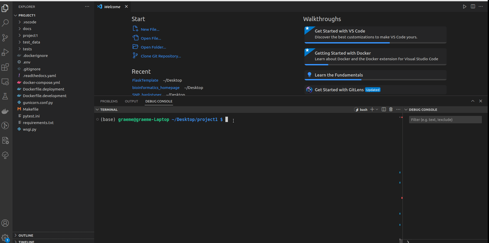
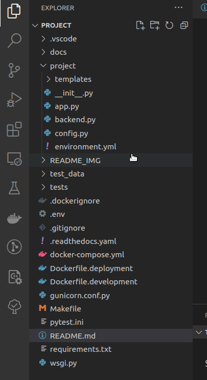

# Flask Webapp Template

A common task in clinical bioinformatics is to add a web front end to a bioinfomatics script to share it with users.  This repository acts as a template, using cookiecutter, to allow developers to quickly create a skeleton repository with all the boilerplate code needed to create a simple web tool ready for attaching to backend code.

## What does this app do?

This repository provides a cookiecutter template for creating a simple flask frontend for bioinformatics projects.  Out of the box the web app allows the user to upload selected files and then download those files in a zipped folder.  By ammending the code in *backend.py* they can insert their own backend scripts to allow the download of the desired output.  The web tool has the following features:

* Full dockerised flask app for easy deployment.
* Upload page - file browser which allows upload of single/multiple files.
* Simple validation of uploaded data.
* Download page - zipped folder can be download containing the output files from backend scripts
* Stubs for Sphinx generated documentation making it easy to upload the docs to readthedocs.com

## What are typical use cases for this script?

This repo allows clinical bioinformaticians to quickly create web front ends for their backend scripts.

## How does this script work?

This script uses `cookiecutter` to produced a customised Flask project from this template.  See the docs at https://cookiecutter.readthedocs.io/en/stable/

## Known Limitations of this Software

This template works best with backend scripts written in python, although the users must ensure any dependencies are added to the docker image.  Scripts written in any language can be supported, although this will require more work as they are likely to have additional dependencies that are not included out of the box.

This web app does not include:

    * User authentification
    * A database

# Usage: Build Project from Template

## Project Template: My Flask Project

This project template provides a boilerplate setup for a Flask-based web application that supports Docker containerization. It includes basic configurations to get you started quickly, along with a predefined Dockerfile for container deployment.

## Prerequisites

Before running this template, ensure you have the following prerequisites installed on your system:

* Python (3.6 or higher)
* Docker (latest version)
* Cookiecutter (latest version)

## Getting Started

Follow these steps to generate and run the Flask project using the provided cookiecutter template:

1. Install Cookiecutter:

   ```bash
   pip install cookiecutter
   ```

2. Generate the Project from the github repo:

   ```bash
   cookiecutter https://github.com/moka-guys/FlaskTemplate.git
   ```

3. Configuration Variables:

   During the project generation, you will be prompted to provide values for the following configuration variables:

   * `project_name`: The name of your Flask project. Defaults to "project".
   * `destination_path`: The path where the generated project will be saved. Defaults to the parent directory of the current directory.
   * `project_description`: Description of your project. Defaults to "default_description".
   * `dockerhub_registry`: Your DockerHub registry for container images. Defaults to "seglh".
   * `port`: The port number on which the Flask application will run. Defaults to 5000.
   * `debugpy_port`: The port number for `debugpy` to enable debugging. Defaults to 5678.
   * `single_file_allowable_extension`: A list of allowable file extensions for single-file upload. Defaults to a list of common file extensions.
   * `multi_file_allowable_extension`: A list of allowable file extensions for multi-file upload. Defaults to a list of common file extensions.

4. Project Structure:

   After successful project generation, you will find the generated Flask project in the specified `destination_path`. The structure of the project will look like this:

   ```
   {{project_name}}/
   |-- app/
   |   |-- __init__.py
   |   |-- views.py
   |-- {{project_name}}/
   |   |-- __init__.py
   |   |-- config.py
   |   |-- models.py
   |-- tests/
   |   |-- test_app.py
   |   |-- test_models.py
   |-- .env
   |-- .flaskenv
   |-- .gitignore
   |-- Dockerfile
   |-- requirements.txt
   ```
   The Flask application will be accessible at `http://localhost:5000/{{project_name}}`.

## Debugging with Visual Studio Code

To debug your Dockerized Flask application live using Visual Studio Code, follow these steps:

1. Start Dockerized Flask in Debug Mode with the command `docker-compose up --build` in the project folder:

   

2. Attach VS Code to Dockerized Flask App in Debug Mode by opening the debugger and launching `Python: Remote Attach` as shown below:

   

The Flask application will now be accessible at `http://localhost:{{cookiecutter.port}}/{{cookiecutter.project_name}}`

## Contributing

If you find any issues or have suggestions for improvement, feel free to submit a pull request or open an issue in the project's repository.

## License

This project is licensed under the MIT License - see the [LICENSE](./LICENSE) file for details.

## Acknowledgements

Thank you to the authors and contributors of Flask, Cookiecutter, and other open-source libraries that made this template possible.

